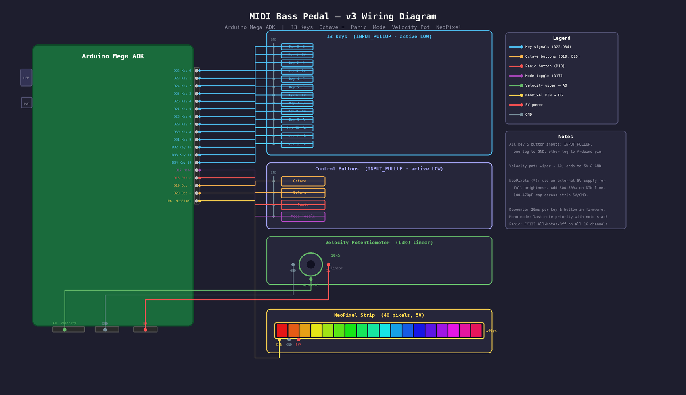

# MIDI Bass Pedal

A DIY 13-note MIDI bass pedalboard built on an **Arduino Mega ADK**.
Press a pedal, send a MIDI note. Twist a knob, set your velocity.
RGB LEDs light up with the note colour. Everything debounced. No compromises.



---

## Features

| Feature | Detail |
|---|---|
| **13 keys** | One full chromatic octave + octave above root |
| **Per-key debounce** | 20 ms independent timer per key — clean triggers every time |
| **Monophonic mode** | Last-note priority with full note stack — release top note, previous resumes |
| **Polyphonic mode** | Independent NoteOn/NoteOff per key; NoteOff always matches its NoteOn |
| **Octave up / down** | Momentary buttons, C0–C8 range, stuck notes silenced on change |
| **Velocity knob** | 10 kΩ pot → A0, mapped 1–127 (velocity 0 never sent) |
| **Panic button** | CC 123 All-Notes-Off + CC 64 Sustain-Off on all 16 MIDI channels |
| **Mode toggle** | Single button latches mono ↔ poly; voice state cleaned on switch |
| **NeoPixel feedback** | 40-pixel strip lights the pitch-class colour at velocity brightness |
| **MIDI channel** | Channel 1 (configurable in firmware) |

---

## Hardware

- Arduino Mega ADK (or any Mega-compatible board)
- 13 momentary foot switches (SPST-NO)
- 4 momentary push buttons (octave −/+, panic, mode)
- 10 kΩ linear potentiometer (velocity)
- WS2812B NeoPixel strip, 40 pixels
- 300–500 Ω resistor on NeoPixel DIN
- 100–470 µF capacitor across NeoPixel 5V/GND
- External 5 V supply recommended for NeoPixel strip at full brightness

---

## Pin Assignments

All digital inputs use `INPUT_PULLUP`. Wire one leg of each switch/button to the pin, the other to GND.

### Keys

| Key | Note | Arduino Pin |
|-----|------|-------------|
| 0   | C    | D22 |
| 1   | C#   | D23 |
| 2   | D    | D24 |
| 3   | D#   | D25 |
| 4   | E    | D26 |
| 5   | F    | D27 |
| 6   | F#   | D28 |
| 7   | G    | D29 |
| 8   | G#   | D30 |
| 9   | A    | D31 |
| 10  | A#   | D32 |
| 11  | B    | D33 |
| 12  | C    | D34 |

### Controls

| Control | Pin | Type |
|---|---|---|
| Octave − | D19 | Momentary button to GND |
| Octave + | D20 | Momentary button to GND |
| Panic | D18 | Momentary button to GND |
| Mode toggle | D17 | Momentary button to GND |
| Velocity | A0 | 10 kΩ pot wiper; ends to 5V and GND |
| NeoPixel DIN | D6 | Via 300–500 Ω series resistor |

---

## NeoPixel Colour Map

Each pitch class has a fixed colour displayed at velocity-scaled brightness.

| Note | Colour |
|------|--------|
| C  | Red `#ff0000` |
| C# | Blue `#0000ff` |
| D  | White `#ffffff` |
| D# | Apple Green `#0ec272` |
| E  | Canary Yellow `#fef11c` |
| F  | Pumpkin Orange `#f0814a` |
| F# | Purple `#b400ff` |
| G  | Mint `#00ff80` |
| G# | Pink `#ff6464` |
| A  | Cyan `#00c8ff` |
| A# | Orange `#ffa500` |
| B  | Lime `#c8ff00` |

---

## Dependencies

Install via the Arduino Library Manager:

- [Arduino MIDI Library](https://github.com/FortySevenEffects/arduino_midi_library) — `MIDI`
- [Adafruit NeoPixel](https://github.com/adafruit/Adafruit_NeoPixel) — `Adafruit_NeoPixel`

---

## Building & Flashing

1. Clone this repo.
2. Open `MIDI-Bass-Pedal/MIDI-Bass-Pedal.ino` in the Arduino IDE.
3. Install the two dependencies above.
4. Select **Arduino Mega ADK** as the board.
5. Upload.

On first boot the NeoPixel strip cycles through all 12 pitch-class colours as a startup animation, then waits for input.

---

## Configuration

All user-tunable values are `#define` / `const` at the top of the sketch.

```cpp
static const int  DEFAULT_OCTAVE = 3;    // starting octave (C3 = bass range)
static const int  OCTAVE_MIN     = 0;
static const int  OCTAVE_MAX     = 8;
static const byte MIDI_CHANNEL   = 1;
static const unsigned long DEBOUNCE_MS = 20;
```

---

## Mono vs Poly mode

**Mono** is the default power-on state and is typical for bass — one note sounds at a time.

- Press a new key while holding another → old note silences, new note sounds.
- Release the top key while another is held → held key resumes (last-note priority stack).

**Poly** lets all 13 pedals sound independently. Each key's NoteOff is always matched to the exact NoteOn it sent, even if the octave changes mid-hold.

Toggle between modes with the Mode button. A panic fires automatically on switch.

---

## Wiring Diagram

The wiring diagram PNG and its Python generator live in `MIDI-Bass-Pedal/`:

```
MIDI-Bass-Pedal/
├── MIDI-Bass-Pedal.ino          ← main sketch
├── MIDI-Bass-Pedal-Wiring.png   ← wiring diagram (rendered)
├── MIDI-Bass-Pedal-Wiring.svg   ← wiring diagram (SVG source)
└── generate_diagram.py           ← Pillow-based diagram generator
```

To regenerate the diagram after hardware changes:

```bash
cd MIDI-Bass-Pedal
python3 generate_diagram.py
```

Requires Python 3 + Pillow (`pip install pillow`).

---

## Archive

Earlier work-in-progress sketches are preserved in [`archive/`](archive/) for reference.

| File | Notes |
|---|---|
| `MIDI-Bass-Pedal.ino` | v1 skeleton — MIDI library wired up, key scanning stubbed |
| `MIDI-Bass-Pedal2.ino` | v2 — NeoPixel feedback added, still no key scanning |
| `MIDI Keyboard.h` | WIP class stub |
| `PCINT.ino` | Pin-change interrupt reference for ATmega168/328 |

The original Fritzing breadboard diagram (`.fzz`) and its render (`MIDI-Bass-Pedal.png`) are at the repo root.

---

## License

Do whatever you want with this. Build pedals. Make music.
